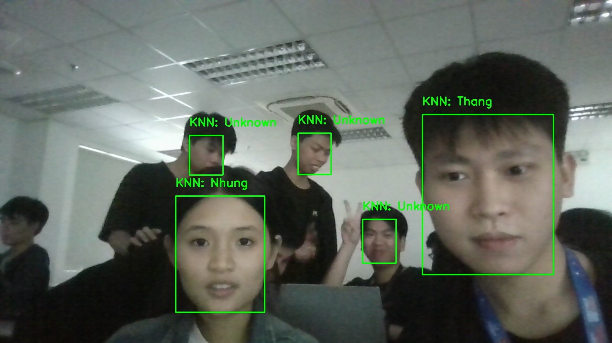

# Machine_Learning
## Bài tập lớn Machine Learning: Sử dụng mô hình học máy để nhận diện khuôn mặt
Thành viên nhóm :
- Nguyễn Văn Thăng
- Phạm Văn Sự
- Đặng Anh Tuyền
## Thu thập và sử lý dữ liệu
- Bộ dữ liệu được thu thập bằng camera.

- Xử lý dữ liệu bằng cách sử dụng mô hình MTCNN phát hiện khuôn mặt và cắt những khuôn mặt đó cho folder với nhãn tương ứng.
- Sau đó kiểm tra bằng phương pháp thủ công để lọc những ảnh không đúng với nhãn.
## Chuẩn bị và huấn luyện mô hình nhận diện
- Sử dụng 2 phương pháp chính để chuẩn bị dữ liệu để huấn luyện mô hình
  - Dùng mô hình CNN VGGFACE2 để trích xuất đặc trưng khuôn mặt.
  - Dùng cách làm phẳng ảnh để đưa ảnh về vecto 1D.
- Huấn luyện các mô hình với bộ dữ liệu đã được chuẩn bị
  - Mô hình K-Nearest Neighbors
  - Mô hình Random Forest
  - Mô hình Support Vector Machine
## Đánh giá mô hình
- Các mô hình đặt được accuracy rất cao

## Chạy thử thục tế
- Các mô hình dữ báo tốt những khuôn mặt

- Sử dụng cammera trực tiếp nhận diện đứng các khuôn mặt

